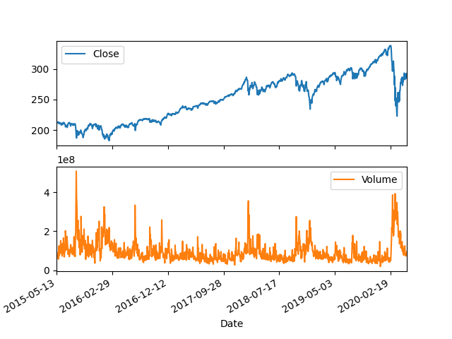
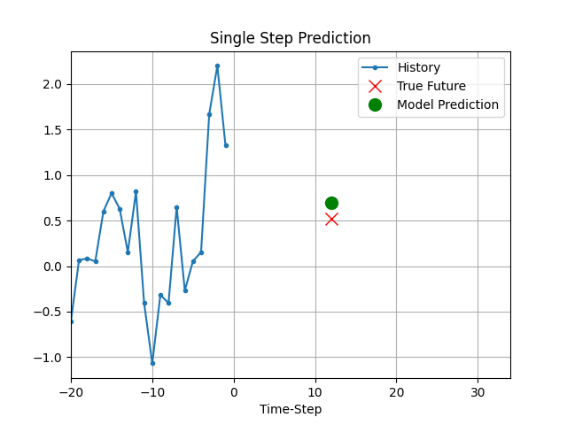
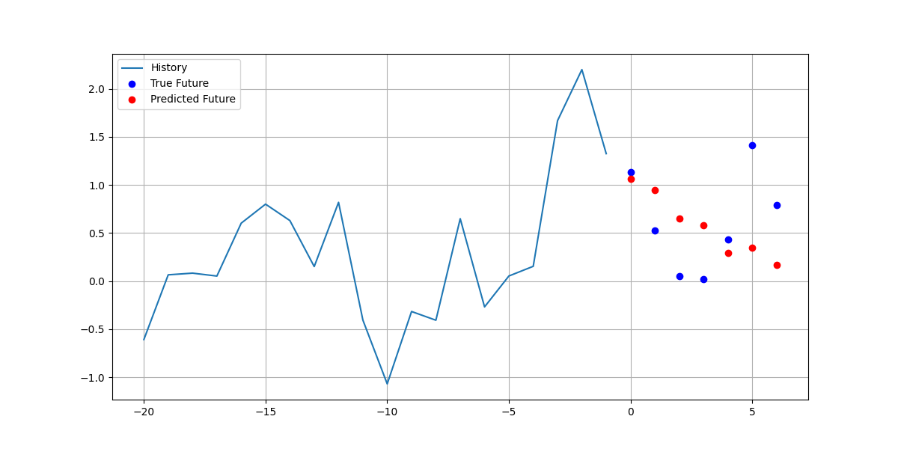

## Stock Forecaster
### Univariate LSTM
```
python univariate_forecast.py
```


### Multivariate Single Step LSTM
```
python multivariate_single_forecast.py
```





### Multivariate Multi Step LSTM
```
python multivariate_multi_forecast.py
```




### Test
```
pytest
```

### References
https://www.tensorflow.org/tutorials/structured_data/time_series
